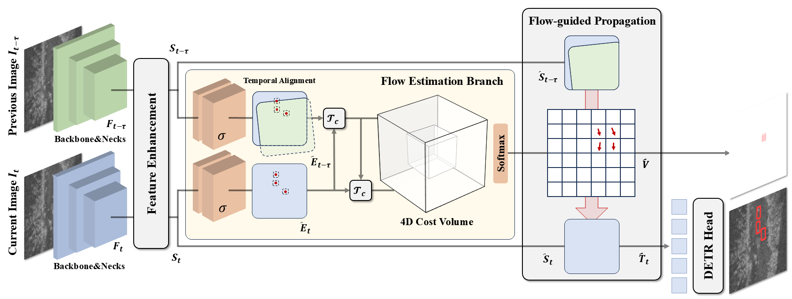

  <h1 align="center">RaFD: Flow-Guided Radar Detection for Robust Autonomous Driving</h1>

  

    <strong>Shuocheng Yang</strong>
    ·
    <strong>Zikun Xu</strong>
    ·
    <strong>Jiahao Wang</strong>
    ·
    <strong>Shahid Nawaz</strong>
    ·
    <strong>Jianqiang Wang*</strong>
    ·
    <strong>Shaobing Xu*</strong>

## Abstract

Radar has shown strong potential for robust perception in autonomous driving; however, raw radar images are frequently degraded by noise and “ghost” artifacts, making object detection based solely on semantic features highly challenging. To address this limitation, we introduce RaFD, a radar-based object detection framework that estimates inter-frame bird’s-eye-view (BEV) flow and leverages the resulting geometric cues to enhance detection accuracy. Specifically, we design a supervised flow estimation auxiliary task that is jointly trained with the detection network. The estimated flow is further utilized to guide feature propagation from the previous frame to the current one. Our flow-guided, radar-only detector achieves achieves state-of-the-art performance on the RADIATE dataset, underscoring the importance of incorporating geometric information to effectively interpret radar signals, which are inherently ambiguous in semantics.

## Overview

## Model Zoo

| Backbone | Method | Split | mAP@0.7 | mAP@0.5 | mAP@0.3 | Config | Download |
| :---: | :---: | :---: | :---: | :---: | :---: | :---: | :---: |
| R34+FPN | RaFD (2) | Train good weather | - | - | - |[config]() |[model]() |
| R34+FPN | RaFD (2) | Train good & bad weather | - | - | - |[config]() |[model]() |
| R34+FPN | RaFD (4) | Train good weather | - | - | - |[config]() |[model]() |
| R34+FPN | RaFD (4) | Train good & bad weather | - | - | - |[config]() |[model]() |

## Visualization

**Qualitative Results on RADIATE Dataset:**

    

    

**Demo on RADIATE Dataset:**

https://github.com/user-attachments/assets/7aafe2a6-03fb-4cba-80e3-fece956c6a8e

## Acknowledgement

Many thanks to these excellent projects:

- [mmdet3d](https://github.com/open-mmlab/mmdetection3d)

- [bevformer](https://github.com/fundamentalvision/BEVFormer)
